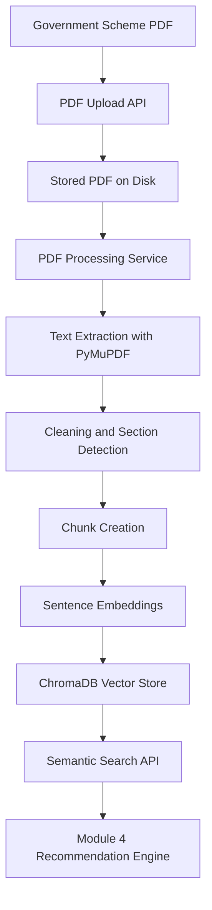

# Module 3 Architecture

Module 3 adds the government scheme knowledge base that feeds Module 4's eligibility engine.

## Pipeline

## Core Components

- `government_scheme_service.py` orchestrates scheme CRUD, upload, processing, and search.
- `scheme_processing_service.py` extracts pages, detects sections, and builds chunks.
- `scheme_embedding_service.py` generates embeddings with Sentence Transformers and a deterministic fallback.
- `vector_store_service.py` manages ChromaDB persistence, updates, deletes, and search.

## Data Flow

1. An admin creates a scheme record.
2. A PDF is uploaded for the scheme.
3. The file is stored under `storage/schemes/{category}/{scheme_name}/`.
4. A background task extracts text, cleans it, and chunks it by section.
5. Each chunk receives an embedding and is written to ChromaDB.
6. Search requests embed the user query and query the vector store.
7. Results are returned to the mobile app and later consumed by Module 4.

## Design Notes

- Scheme deletion is soft-delete at the relational layer.
- Vector entries are removed when a scheme is deleted.
- PDF processing is isolated from request handling so uploads do not block the API.
- The embedding layer can be replaced later with another sentence encoder without changing the API surface.
