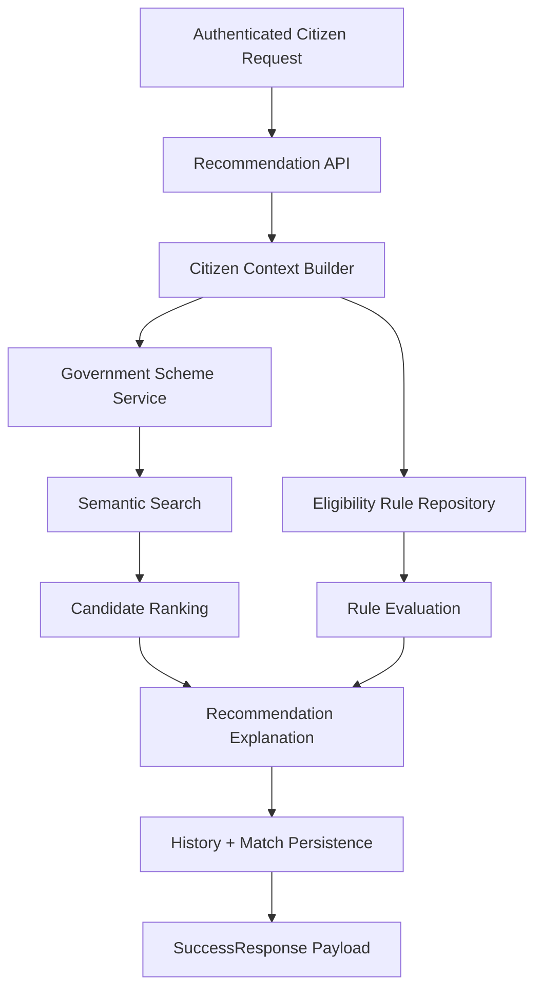

# Module 4 Architecture

Module 4 adds the eligibility and recommendation engine that evaluates citizen context against scheme rules and returns ranked matches.

## Request Flow

## Core Components

- `app/api/recommendation_routes.py` exposes authenticated recommendation and eligibility endpoints.
- `app/services/recommendation_service.py` builds citizen context, evaluates rules, ranks candidates, and persists history.
- `app/repositories/recommendation_repository.py` stores rule definitions, history rows, logs, matches, and feedback.
- `app/models/recommendation.py` defines the persistence layer for Module 4 tables.

## Design Notes

- Module 4 reuses the existing citizen, profile, DigiLocker, and scheme repositories instead of duplicating data access.
- Semantic search is optional at runtime; the recommendation service falls back to scheme listing when vector search is unavailable.
- History and match records are written on every generation request so the API can support retrieval, auditing, and feedback.
- The engine keeps eligibility evaluation and ranking separate so rule changes do not require API changes.